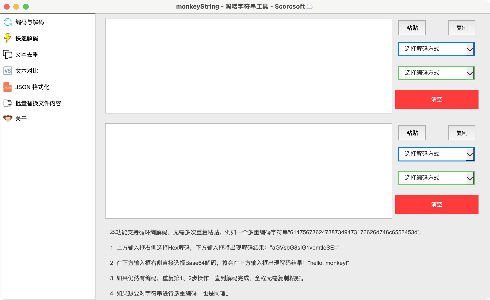
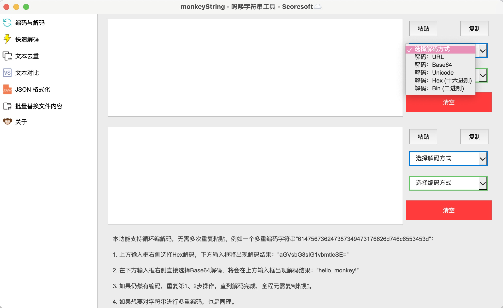
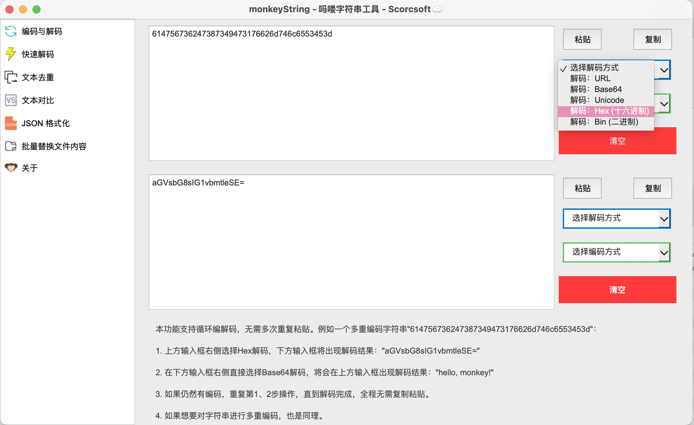
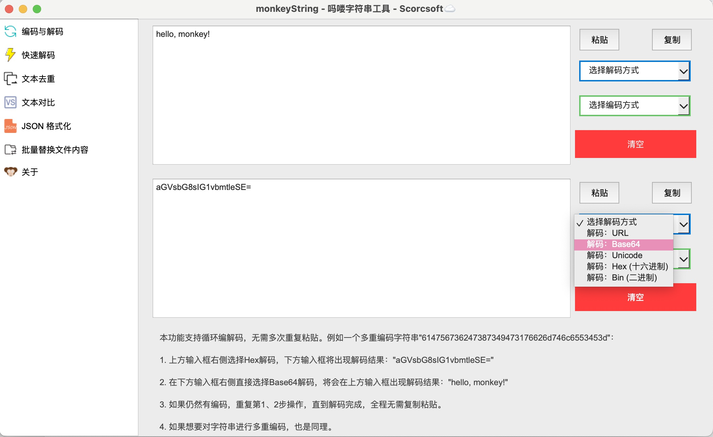
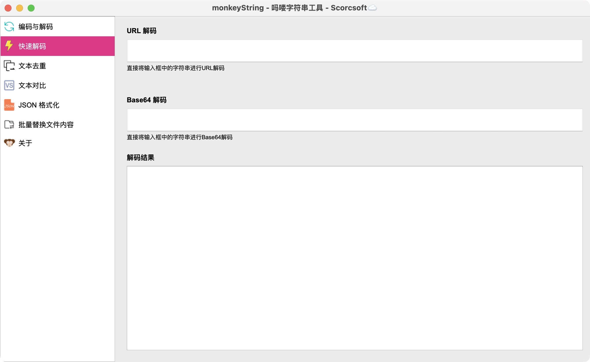
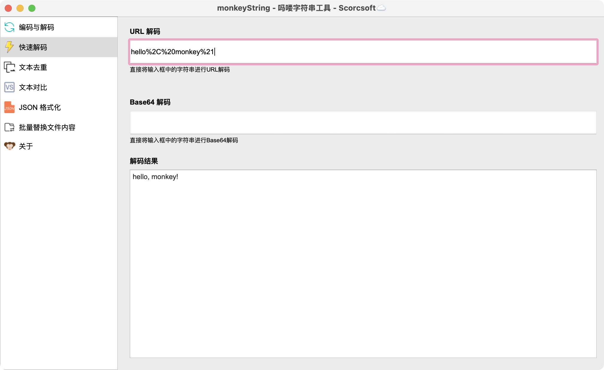
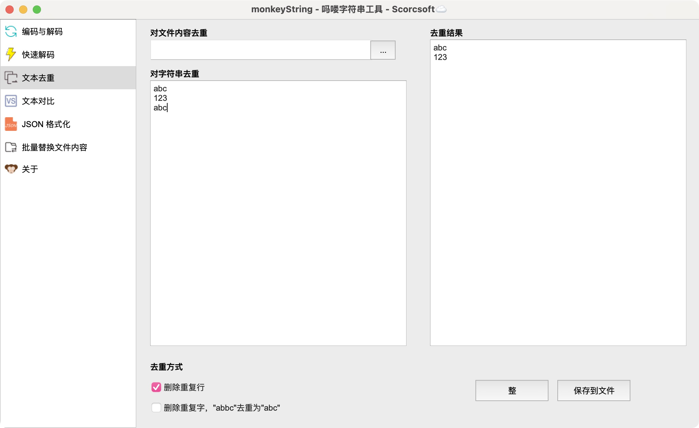
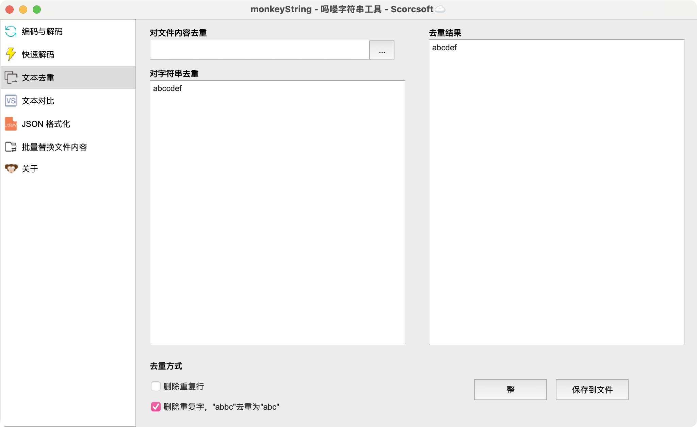
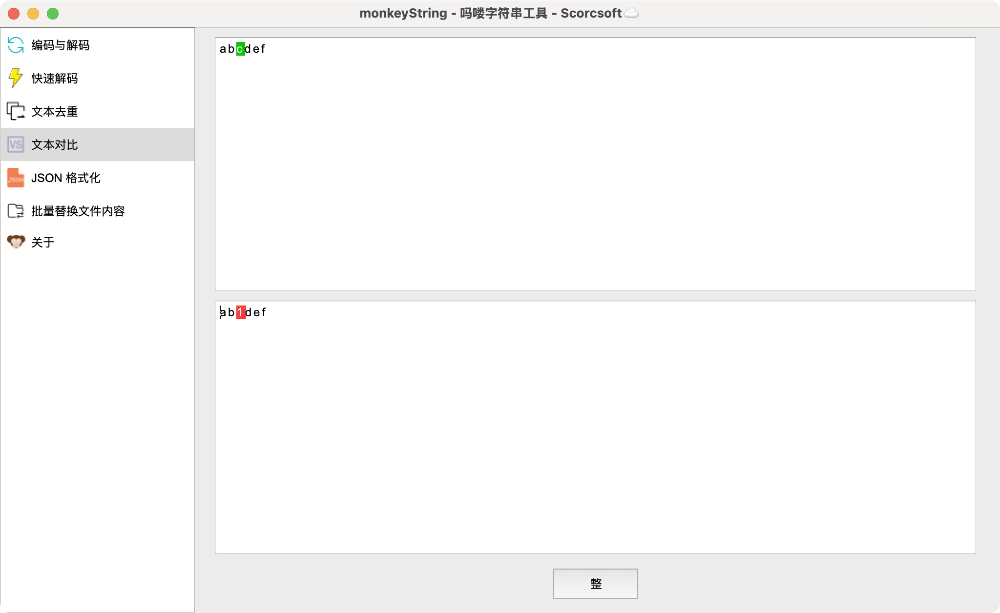

# Monkey String 吗喽字符串
一个图形化的字符串工具，帮助我们在快速进行编解码转换、字符串对比、去重等对字符串的处理。

</img>

# 开始使用
本工具使用Python3 + PyQt5开发，请确保已经安装了对应模块：
```angular2html
pip3 install -r requirements.txt
```

# 如果你无法正常安装第三方模块，请查看Release中已经打包好的可执行文件

# 编码与解码模块
编码与解码模块提供了一个循环编解码功能，支持以下方式的编/解码：
1. URL编解码
2. Base64编解码
3. Unicode编解码
4. 十六进制与字符串互相转换
5. 二进制与字符串互相转换

</img>

本模块支持循环编解码，无需多次复制粘贴，假设有一个字符串：
```angular2html
614756736247387349473176626d746c6553453d
```

首先在上方输入框输入该字符串，并选择右侧的解码方式为 Hex ，即可在下方输入框得到 Hex 转字符串的解码结果：

</img>

发现 Hex 转字符串的结果是一个 Base64 编码，我们无需复制这个 Base64 编码的字符串然后粘贴到上面的输入框

而是在下方输入框的右侧直接选择解码方式为 Base64 ：

</img>

这个 Base64 编码的界面结果会显示到上面的输入框，省去了多次复制粘贴操作。 如果这个字符串拥有多重编码，只需重复上述步骤一层一层解码即可。

# 快速解码模块
快速界面模块提供了 URL 和 Base64 两种编码的快速解码，只需粘贴字符串到输入框即可自动解码：

</img>

</img>

# 文本去重模块
文本去重模块支持对文件和对字符串进行去重，去重方式支持逐行去重和逐字去重两种。

## 逐行去重
很明显，逐行去重就是删除重复行，例如：
```angular2html
abc
123
abc
```

存在重复行：`abc`，那么去重结果就是：
```angular2html
abc
123
```

</img>

## 逐字去重
很明显，逐字去重就是删除重复的字，例如：
`abccdef`，存在重复的字`c`，那么去重结果就是`abcdef`：

</img>

# 文本对比
文本对比模块的作用是对比两个字符串中不一样的地方：
</img>

# JSON 格式化
JSON格式化模块的作用是格式化JSON。

# 批量替换文件内容
批量替换文件内容模块的作用是对文件内容批量替换。最近太忙了还没写。

# 关于
关于模块的作用是显示关于？？？